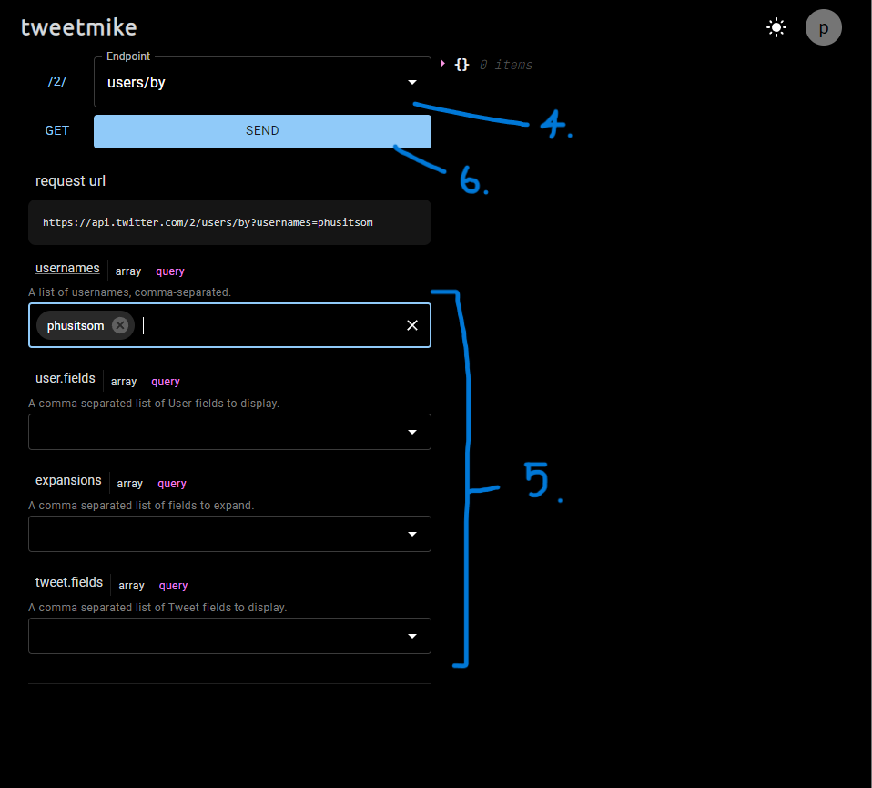

# tweetmike
Tweetmike is a website that let you play with Twitter API easily.

# Tutorial

1. Go to https://tweetmike.vercel.app/.
2. Click `SIGN IN WITH TWITTER` button.
3. If you are not redirected to `/playground`, click `GO TO PLAYGROUND` button.
4. Choose an endpoint with the autocomplete textfield above `SEND` button.
5. Fill all required fields.
6. Click `SEND` button.
The result will be displayed on the right.


## Getting Started

To get started, just clone the repository and run npm install && npm run dev:

```bash
git clone https://github.com/phusitsom/tweetmike
npm install
npm run dev
```

Open [http://localhost:3000](http://localhost:3000) with your browser to see the result.

### API routes
You can use `/api/2/` prefix to call Twitter API v2 directly.
#### Example:
```bash
http://localhost:3000/api/2/users/me
```

and `/api/1.1/` for Twitter API v1.1.